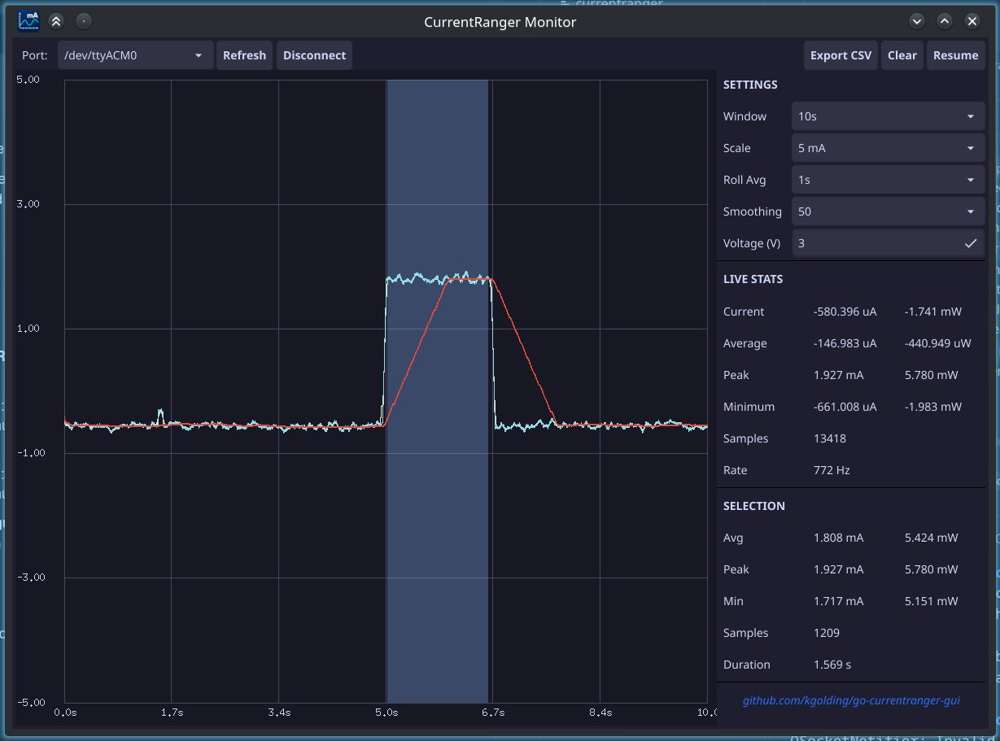

# CurrentRanger GUI

Real-time current monitoring GUI for the [LowPowerLab CurrentRanger](https://lowpowerlab.com/guide/currentranger/) USB precision current meter.

Connects over USB serial, parses the CurrentRanger's scientific-notation output, and plots current draw in real time in a dark-themed desktop window.



## About this port

This is a Go / [Fyne](https://fyne.io) port of [SasquatchCollective/current-ranger-gui](https://github.com/SasquatchCollective/current-ranger-gui).

The goal of the port is to make it **easier to run**. There is no Python interpreter, no `pip install`, no virtualenv, and no Matplotlib/Tk system packages to line up. It builds to a **single self-contained binary** per platform — download it (or the `.deb`), run it, and connect. It also works consistently across Linux, Windows and macOS.

Feature parity with the original is the aim: the plotting, envelope downsampling, rolling averages, click-and-drag selection stats, scroll-to-zoom and CSV export all behave the same way.

## Features

- Auto-detects the CurrentRanger serial port (with a manual picker and refresh)
- Handles the device's USB-logging (`u`) toggle handshake on connect
- Real-time scrolling plot with raw trace, running average and a time-based rolling average
- Live stats: current, average, peak, minimum, sample count, sample rate
- Click-and-drag selection for stats over a region of the trace (avg, peak, min, samples, duration)
- Scroll to zoom, pause/resume to inspect
- Adjustable time window (1s–60s, 5m, all) and Y-axis scale (auto, or fixed 100 µA – 1 A)
- Adjustable rolling-average window (5 ms – 30 s)
- Export to CSV — the full buffer, or just the selected region
- Min/max envelope downsampling for smooth rendering of large datasets
- ~500k-sample rolling buffer (~6 minutes at 1300 Hz)

## Requirements

**To run:** a [LowPowerLab CurrentRanger](https://lowpowerlab.com/guide/currentranger/) connected via USB. Nothing else — the binary is self-contained.

**To build from source:** Go 1.22+. On Linux you also need the usual Fyne/OpenGL build dependencies:

```bash
sudo apt-get install gcc libgl1-mesa-dev xorg-dev
```

## Install

Download the latest build for your platform from the [Releases](https://github.com/kgolding/go-currentranger-gui/releases) page:

- **Linux** — `.tar.xz` archive, or a `.deb` package
- **Windows** — `.zip` containing a signed `.exe`
- **macOS** — build from source (see below)

Or build it yourself:

```bash
git clone https://github.com/kgolding/go-currentranger-gui.git
cd go-currentranger-gui
go build -o currentranger .
```

## Usage

Run the app and pick the port in the toolbar, or pass one explicitly:

```bash
./currentranger --port /dev/ttyACM0
```

`--port` (`-p`) is optional; without it the app scans for a likely CurrentRanger port and connects automatically.

## Platform support

Serial-port auto-detection looks for `usbmodem` / `currentranger` device names and otherwise falls back to the first available port; you can always override it with `--port`. The dark theme and layout are the same on every platform.

## License

MIT — see [LICENSE](LICENSE).

Original work copyright (c) 2026 [The Sasquatch Collective LLC](https://sasq.io). Go/Fyne port by Kevin Golding.
